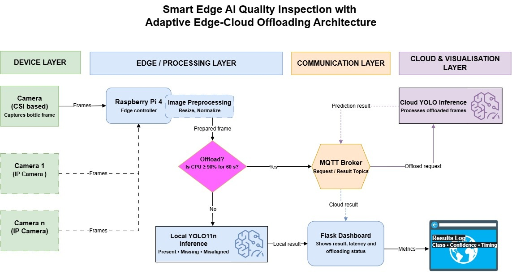

# Adaptive Edge AI Bottle-Label Inspection

An IoT-based quality-inspection prototype that uses Edge AI to identify bottles with **present, missing and misaligned labels**. The system normally performs inference locally on a Raspberry Pi and selectively offloads processing to a cloud inference service through MQTT when sustained processor utilisation becomes high.

## Live interactive demonstration

[Open the interactive project website](https://subendra.github.io/newsite/)

> The website provides an illustrative replay of the system workflow using recorded project measurements. It is not a live inference session.

## Project overview

The prototype combines a Raspberry Pi 4, IMX219 camera, a lightweight YOLO11n object-detection model and adaptive edge–cloud processing.

The model was exported to NCNN for deployment on the Raspberry Pi. Under normal conditions, images are processed locally. When CPU utilisation remains at or above 90% for 60 seconds, a captured frame is encoded and transferred to the cloud through MQTT for inference.

The system returns to local processing when CPU utilisation remains at or below 65% for 20 seconds. A minimum cloud-processing duration of 30 seconds helps prevent frequent switching between execution modes.

## Inspection classes

- ✓ **Label present** — the bottle has a correctly positioned label.
- ! **Label missing** — no label is detected in the expected area.
- ↗ **Label misaligned** — the label is visibly tilted or incorrectly positioned.

## How the system works

1. The camera captures a bottle image.
2. The Raspberry Pi prepares the image for inference.
3. The adaptive controller checks the current CPU utilisation.
4. Under normal load, YOLO11n performs local inference using NCNN.
5. Under sustained high load, the image is encoded as Base64 and published through MQTT.
6. The cloud inference service processes the image and returns the prediction.
7. The Flask dashboard displays and records the final inspection result.

## System architecture



## Model performance

The model was evaluated using a separate controlled test set containing 46 images.

| Metric | Result |
|---|---:|
| Precision | 98.8% |
| Recall | 100% |
| F1 score | 99.4% |
| mAP50 | 99.5% |
| mAP50–95 | 76.3% |
| Raspberry Pi inference latency | 424–545 ms |
| Mean MQTT round-trip time | 538.39 ms |
| Successful cloud responses | 32/32 |

These results should be interpreted cautiously because the test set was relatively small and controlled. Live performance was affected by changes in lighting, background and bottle position.

## Dataset

The three-class dataset combined existing bottle images with additional user-collected photographs.

| Split | Images |
|---|---:|
| Training | 326 |
| Validation | 93 |
| Testing | 46 |

The model was trained for 100 epochs using an image size of 640 pixels and a batch size of 8.

## Technologies used

- Raspberry Pi 4
- IMX219 camera
- Python
- Ultralytics YOLO11n
- NCNN
- Flask
- MQTT
- HTML, CSS and JavaScript
- Cloud-based inference service
- stress-ng for controlled CPU-load testing

## MQTT communication

The prototype uses MQTT QoS 0 for lightweight request and result exchange. Messages contain a unique request identifier to correlate offloading requests with cloud responses. TLS and authentication are used for broker communication.

Main topic structure:

```text
bottle-system/v1/rpi4-bottle-01/edge/result
bottle-system/v1/rpi4-bottle-01/edge/status
bottle-system/v1/rpi4-bottle-01/offload/request
bottle-system/v1/rpi4-bottle-01/cloud/result
```

## Inclusive design

The interactive website includes:

- High-contrast text and controls
- Colour combined with icons and written labels
- Keyboard-accessible controls
- Visible keyboard-focus indicators
- Descriptive image alternative text
- Captions for visual media
- A pause control for animation
- Reduced-motion support
- Responsive layouts for different screen sizes

## Run the website locally

Clone the repository:

```bash
git clone https://github.com/subendra/newsite.git
cd newsite
```

Start a local static server:

```bash
python -m http.server 8000
```

Open the following address in a browser:

```text
http://localhost:8000
```

## Limitations and future work

- Expand the dataset across more lighting conditions, backgrounds and bottle positions.
- Test the system on a physical conveyor.
- Integrate automated rejection hardware.
- Compare adaptive decisions under different network conditions.
- Evaluate additional offloading inputs, including latency and network quality.
- Conduct longer-duration tests in a realistic production environment.

## Academic context

This proof-of-concept was developed as part of an MSc Internet of Things Engineering project. It demonstrates the integration of object detection, resource-constrained edge computing, MQTT communication and adaptive edge–cloud offloading for packaged-product quality inspection.
